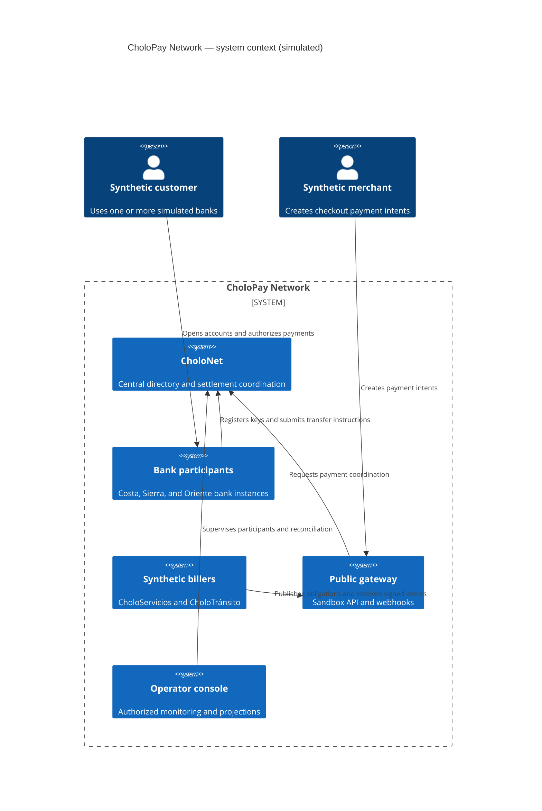

# C4 context

```mermaid
C4Context
    title CholoPay Network — system context (simulated)
    Person(customer, "Synthetic customer", "Uses one or more simulated banks")
    Person(merchant, "Synthetic merchant", "Creates checkout payment intents")
    System_Boundary(cholo, "CholoPay Network") {
      System(network, "CholoNet", "Central directory and settlement coordination")
      System(bank, "Bank participants", "Costa, Sierra, and Oriente bank instances")
      System(billers, "Synthetic billers", "CholoServicios and CholoTránsito")
      System(gateway, "Public gateway", "Sandbox API and webhooks")
      System(operator, "Operator console", "Authorized monitoring and projections")
    }
    Rel(customer, bank, "Opens accounts and authorizes payments")
    Rel(bank, network, "Registers keys and submits transfer instructions")
    Rel(merchant, gateway, "Creates payment intents")
    Rel(gateway, network, "Requests payment coordination")
    Rel(billers, gateway, "Publishes obligations and receives signed events")
    Rel(operator, network, "Supervises participants and reconciliation")
```

The central operator is a technical simulator and must not be described as a real central bank or retail account provider.
